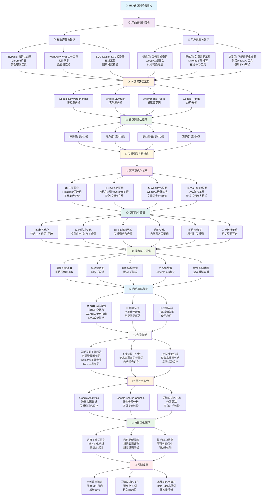

# HolaTiger SEO关键词挖掘与落地页优化指南

## 🎯 概述

本指南结合HolaTiger项目的实际情况，提供完整的关键词挖掘和SEO优化流程，帮助提升网站自然流量和品牌知名度。

## 📊 SEO关键词挖掘流程图

## 🎯 针对HolaTiger的具体建议

### 1. 核心关键词策略

#### 品牌关键词
- **主品牌词**: "HolaTiger"、"虎啦"、"HolaTiger工具"
- **品牌长尾**: "HolaTiger密码工具"、"虎啦WebDAV"、"HolaTiger SVG转换"

#### 产品关键词
- **TinyPass相关**:
  - 核心词: "密码生成器"、"Chrome密码扩展"、"安全密码工具"
  - 长尾词: "免费Chrome密码扩展"、"在线密码生成器"、"安全密码管理器"
  
- **WebDavy相关**:
  - 核心词: "WebDAV工具"、"文件同步工具"、"云存储连接"
  - 长尾词: "WebDAV客户端"、"文件同步软件"、"云存储管理工具"
  
- **SVG Studio相关**:
  - 核心词: "SVG转换器"、"在线SVG工具"、"图片格式转换"
  - 长尾词: "SVG转PNG"、"在线图片转换"、"SVG编辑器"

#### 用户意图关键词
- **信息型**: "如何生成安全密码"、"WebDAV是什么"、"SVG转换方法"
- **导航型**: "免费密码工具"、"Chrome扩展推荐"、"在线SVG工具"
- **交易型**: "下载密码生成器"、"WebDAV连接工具"、"使用SVG转换"

### 2. 落地页优化重点

#### 主页优化
- **Title**: "HolaTiger - 个人工具集合 | 密码生成器、WebDAV工具、SVG转换器"
- **Meta描述**: "HolaTiger提供轻量实用的个人工具集合，包括TinyPass密码生成器、WebDavy文件同步工具、SVG Studio在线转换器。免费使用，开箱即用。"
- **H1**: "虎啦 HolaTiger - 小工具，大能量"
- **内容重点**: 强调"个人工具集合"、"轻量实用"、"开箱即用"、"免费使用"

#### TinyPass页面优化
- **Title**: "TinyPass - 免费Chrome密码生成器 | 安全密码工具"
- **Meta描述**: "TinyPass是免费的Chrome扩展密码生成器，支持多种复杂度设置和自定义规则。本地生成，安全可靠，一键安装。"
- **关键词重点**: "安全"、"免费"、"Chrome扩展"、"密码管理"、"本地生成"

#### WebDavy页面优化
- **Title**: "WebDavy - WebDAV连接工具 | 文件同步管理"
- **Meta描述**: "WebDavy是专业的WebDAV连接工具，简化文件同步和管理流程。支持多种云存储服务，安全可靠。"
- **关键词重点**: "文件同步"、"云存储"、"WebDAV连接"、"文件管理"

#### SVG Studio页面优化
- **Title**: "SVG Studio - 在线SVG转换工具 | 多格式支持"
- **Meta描述**: "SVG Studio是免费的在线SVG转换工具，支持多种格式输出和实时预览功能。无需注册，即用即走。"
- **关键词重点**: "在线工具"、"格式转换"、"实时预览"、"免费使用"

### 3. 内容营销策略

#### 博客内容规划
- **密码安全系列**:
  - "如何创建强密码：TinyPass使用指南"
  - "密码管理最佳实践：保护你的数字身份"
  - "Chrome扩展安全指南：选择可信的密码工具"
  
- **WebDAV使用指南**:
  - "WebDAV是什么：文件同步的现代解决方案"
  - "WebDavy使用教程：连接你的云存储"
  - "文件同步最佳实践：多设备数据管理"
  
- **SVG设计技巧**:
  - "SVG vs PNG：选择正确的图片格式"
  - "SVG Studio使用指南：快速转换图片格式"
  - "矢量图形设计基础：从SVG开始"

#### 帮助文档
- 产品使用教程
- 常见问题解答
- 故障排除指南
- 功能更新说明

#### 视频内容
- 工具演示视频
- 使用教程
- 功能对比视频

### 4. 技术SEO优化

#### 页面性能优化
- 图片压缩和WebP格式转换
- 启用CDN加速
- 代码压缩和合并
- 懒加载实现

#### 移动端优化
- 响应式设计完善
- 触摸友好的交互
- 移动端页面速度优化
- AMP页面考虑

#### 结构化数据
- 产品信息标记
- 组织信息标记
- 软件应用标记
- 面包屑导航标记

#### 网站结构优化
- 清晰的URL结构
- 内部链接策略
- XML网站地图
- 机器人文件优化

### 5. 竞品分析重点

#### 密码工具竞品
- 1Password、LastPass、Bitwarden
- 分析其关键词策略和内容营销
- 识别内容缺口和机会

#### WebDAV工具竞品
- Cyberduck、WinSCP、FileZilla
- 分析其功能定位和用户需求
- 发现差异化机会

#### SVG工具竞品
- Convertio、CloudConvert、SVG-Edit
- 分析其用户体验和功能特色
- 识别改进空间

### 6. 监控指标与目标

#### 关键指标
- **自然流量**: 目标3个月内增长50%
- **关键词排名**: 核心词进入前10位
- **品牌搜索**: HolaTiger品牌词搜索量增长
- **页面停留时间**: 提升用户参与度
- **跳出率**: 降低至50%以下

#### 监控工具
- Google Analytics 4
- Google Search Console
- Ahrefs/SEMrush
- 自定义关键词排名监控

#### 报告频率
- 每周关键词排名检查
- 每月流量和转化分析
- 每季度SEO策略调整

## 📅 实施时间表

### 第1个月：基础优化
- [ ] 关键词研究和优先级排序
- [ ] 页面Title和Meta标签优化
- [ ] 技术SEO基础检查
- [ ] 竞品分析完成

### 第2个月：内容建设
- [ ] 核心页面内容优化
- [ ] 博客内容开始发布
- [ ] 帮助文档完善
- [ ] 内部链接策略实施

### 第3个月：监控优化
- [ ] 数据分析工具配置
- [ ] 关键词排名监控
- [ ] 内容效果评估
- [ ] 策略调整和优化

## 🔗 相关资源

- [Google Keyword Planner](https://ads.google.com/home/tools/keyword-planner/)
- [Google Search Console](https://search.google.com/search-console/)
- [Ahrefs Keyword Explorer](https://ahrefs.com/keyword-explorer)
- [Answer The Public](https://answerthepublic.com/)
- [Google Trends](https://trends.google.com/)

---

*本指南将根据实际执行情况和数据反馈持续更新优化。*
